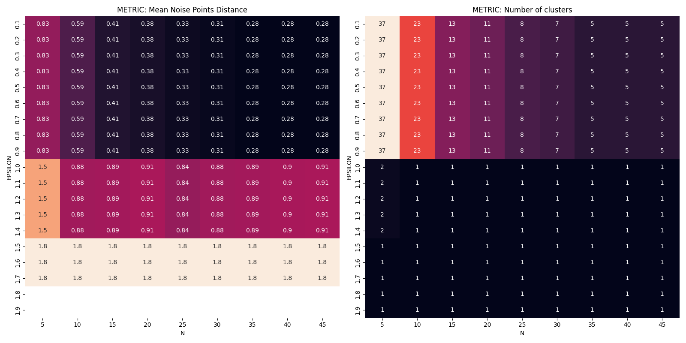

# Operazioni preliminari - salvataggio dei brani
L’obbiettivo è quello di salvare in un file csv le canzoni presenti nei brani preferiti nell’account di @michele dibisceglia. Innanzitutto sono stati recuperati dalla piattaforma spotify developer [https://developer.spotify.com/dashboard/1572e8f11a55483ba6336cc98058160e/settings](https://developer.spotify.com/dashboard/1572e8f11a55483ba6336cc98058160e/settings) `client_id`, `client_secret` e `redirect_uri` per poter effettuare la fase di autenticazione. Sono state create tre tabelle, collegate tra loro mediante gli id (come se fosse un database relazionale). rispettivamente, brani, artisti e album per una migliore organizzazione e congruenza dei dati. In una fase successiva del progetto, queste associazioni andranno fatte con Prolog. Utilizzando la funzione `current_user_saved_tracks()` e la funzione `audio_features(track_id)`, passandogli come parametro l’id di ogni brano, sono stati recuperati i seguenti dati:

- `track_id`: Spotify ID del brano;
- `track_added_at`: data e ora in cui il brano è stato salvato. Il timestamps è restituito in formato ISO 8601 come Coordinated Universal Time (UTC): YYYY-MM-DDTHH:MM:SSZ;
- `track_name`: nome del brano;
- `album_id`: album di appartenenza del brano;
- `main_artist_id`: artista principale del brano;
- `side_artists_id`: lista di artisti secondari che hanno partecipato nel brano;
- `track_duration`: durata in millisecondi del brano
- `track_explicit`: variabile booleana che indica se nel brano sono presenti riferimenti espliciti
- `track_popularity`: popolarità della traccia. Si tratta di un valore compreso tra 0 e 100, in cui 100 indica più popolare. La popolarità è calcolata tramite un algoritmo (interno di Spotify) ed è basato maggiormente, sul numero totale di riproduzioni del brano e su quanto sono recenti;
- `track_key`: La tonalità in cui si trova la traccia. Gli interi corrispondono alle tonalità utilizzando la notazione standard della Pitch Class. Ad esempio, 0 = C, 1 = C♯/D♭, 2 = D e così via. Se non è stata rilevata alcuna tonalità, il valore è -1.
- `track_bpm (*tempo*)`: Il tempo complessivo stimato di un brano in battiti al minuto (BPM). Nella terminologia musicale, il tempo è la velocità o il ritmo di un determinato brano e deriva direttamente dalla durata media dei battiti.
- `track_energy`: L'energia è una misura che va da 0,0 a 1,0 e rappresenta una misura percettiva dell'intensità e dell'attività. In genere, i brani energetici sono veloci, forti e rumorosi. Ad esempio, il death metal ha un'energia elevata, mentre un preludio di Bach ha un punteggio basso su questa scala. Le caratteristiche percettive che contribuiscono a questo attributo includono la gamma dinamica, il volume percepito, il timbro, la velocità di insorgenza e l'entropia generale.
- `track_danceability`: La ballabilità descrive quanto un brano sia adatto al ballo in base a una combinazione di elementi musicali, tra cui il tempo, la stabilità del ritmo, la forza del battito e la regolarità generale. Un valore di 0,0 è il meno ballabile e di 1,0 è il più ballabile.
- `track_happiness (*valence*)`: Una misura da 0,0 a 1,0 che descrive la positività musicale trasmessa da un brano. I brani con alta valenza suonano più positivi (ad esempio, felici, allegri, euforici), mentre quelli con bassa valenza suonano più negativi (ad esempio, tristi, depressi, arrabbiati).
- `track_loudness`: Il volume complessivo di una traccia in decibel (dB). I valori di loudness sono mediati sull'intero brano e sono utili per confrontare il volume relativo dei brani. Il loudness è la qualità di un suono che è il principale correlato psicologico della forza fisica (ampiezza). I valori sono tipicamente compresi tra -60 e 0 db.
- `track_acousticness`: Una misura di fiducia da 0,0 a 1,0 che indica se il brano è acustico. 1,0 rappresenta un'elevata fiducia che il brano sia acustico.
- `track_instrumentalness`: Prevede se un brano non contiene voci. I suoni "ooh" e "aah" sono considerati strumentali in questo contesto. I brani rap o parlati sono chiaramente "vocali". Più il valore di strumentalità è vicino a 1,0, maggiore è la probabilità che il brano non contenga contenuti vocali. I valori superiori a 0,5 sono intesi come tracce strumentali, ma la fiducia è maggiore man mano che il valore si avvicina a 1,0.
- `track_liveness`: Rileva la presenza di un pubblico nella registrazione. Valori di vivacità più alti rappresentano una maggiore probabilità che il brano sia stato eseguito dal vivo. Un valore superiore a 0,8 indica una forte probabilità che il brano sia dal vivo.
- `track_mode`: Il modo indica la modalità (maggiore o minore) di un brano, cioè il tipo di scala da cui deriva il suo contenuto melodico. Maggiore è rappresentato da 1 e minore da 0.
- `track_speechiness`: speechiness rileva la presenza di parole parlate in una traccia. Più la registrazione è esclusivamente di tipo parlato (ad esempio, talk show, audiolibri, poesie), più il valore dell'attributo è vicino a 1,0. I valori superiori a 0,66 descrivono tracce che probabilmente sono costituite interamente da parole parlate. I valori compresi tra 0,33 e 0,66 descrivono tracce che possono contenere sia musica che parlato, in sezioni o stratificati, compresi i casi di musica rap. I valori inferiori a 0,33 rappresentano molto probabilmente musica e altre tracce non simili al parlato.
- `track_time_signature`: Una firma temporale stimata. La firma temporale (metro) è una convenzione di notazione per specificare quante battute ci sono in ogni battuta (o misura). La firma temporale va da 3 a 7, indicando firme temporali da "3/4" a "7/4".

Una volta che sono stati recuperati tutti i brani preferiti, questi sono stati salvati nel file *saved_tracks_2023-07-22.csv*.

Per gli album invece, utilizzando la funzione `album(album_id)` sono stati recuperati i seguenti dati:

- `album_id`: ID Spotify dell’album
- `album_name`: nome dell’album
- `album_total_track`: numero di brano presenti nell’album
- `album_type`: tipo di album (sotto forma di stringa) i cui unici valori consentiti sono ‘*album*’, ‘*compilation*’ e ‘*single*’
- `album_label`: etichetta discografica che ha prodotto l’album
- `album_popularity`: popolarità dell’album. Il valore è compreso da 0 e 100 dove 100 indica maggiore popolarità.

Tra di dati che potevano essere recuperati tramite l’API era presente anche il campo `album_genres` il quale dovrebbe indicare il genere (o i generi) dell’album. Dopo una prima valutazione si è notato che questo campo facendo richiesta all’API viene sempre restituito vuoto, per questo motivo è stato omesso.

In ultimo, i dati degli artisti, recuperati utilizzando la funzione `artist(artist_id)` 

- `artist_id`: ID Spotify dell’artista
- `artist_name`: nome dell’artista
- `artist_followers`: numero di seguaci dell’artista
- `artist_genres`: generi musicali dell’artista
- `artist_popularity`: popolarità dell’artista. Il valore è compreso tra 0 e 100 dove 100 indica maggiore popolarità

Ciascuna delle tre tabelle, dopo aver eliminato eventuali righe duplicate, sono state salvate in file csv.

Successivamente, si è proceduto a raccogliere ulteriori dati in merito alle preferenze dell’utente, in particolare, in determinati periodi temporali, quali, ultimi 7 giorni, ultimi 30 giorni e da quando è stato registrato l’account, è stato possibile recuperare i **brani e gli artisti più ascoltati** nei tre periodi sopracitati. Per poter recuperare gli artisti più ascoltati è stata utilizzata la funzione `current_user_top_artists`, mentre per i brani più ascoltati `current_user_top_tracks`. Sono stati salvati in file csv separati differenziando i brani dagli artisti e rispettivamente i tre periodi. 

# Apprendimento non supervisionato - clustering degli artisti

Una volta che sono stati recuperati gli artisti, l’obiettivo è stato quello di trovare gli artisti simili tra di loro. Per fare ciò, sono stati considerati i generi musicali trattati dai singoli artisti e si è utilizzato l’algoritmo di **apprendimento non supervisionato DBSCAN** per poter definire dei cluster degli artisti. 

Dato che le colonne sono state ottenute tramite l'applicazione del `MultiLabelBinarizer` a etichette multiclasse, allora è possibile che si verifichino delle distribuzioni lontante da 0,5. Questo è comune quando si lavora con le trasformazioni multicasse in dati binari. La scelta dell'algoritmo di clustering DBSCAN è motivata dal fatto che questo sia noto per essere robusto alle distribuzioni irregolari. 

Il **DBSCAN** è un algoritmo di clustering che fa parte della categoria dei cosiddetti *density-based* perché non fa altro che individuare zone dello spazio delle *features* in cui la densità dei punti (o osservazioni) è maggiore. Tutte quelle osservazioni vicine tra loro vengono raggruppate in cluster. Quelle che invece sembrano isolate sono etichettate come *noise* o rumore. Il DBSCAN necessita di due iperparametri:
- **ε**: che corrisponde alla distanza all'interno della quale *ricercare* punti vicini
- **n**: che corrisponde al numero minimo di punti affiché si formi un *cluster*.
Possiamo dunque dire che il DBSCAN non fa altro che cercare tutti quei *cluster* i cui punti sono un numero maggiore o uguale ad **n** e distanti tra loro meno di **ε**.

Dato che il DBSCAN è un modello non supervisionato non gode di nessuna metrica per calcolare l'accuratezza. Tuttavia possiamo provare a ragionare per cercare un modo che ci aiuti ad individuare la miglior combinazione degli iperparametri per i nostri scopi. Il miglior modo per valutare le *performance* di un modello è osservare come cambiano le metriche al variare dei suoi iperparametri. Dato che il DBSCAN si preoccupa poco della forma del cluster l'utilizzo di una metrica come l'indice di Silhouette sarebbe inappropriato. Proprio per questo motivo possiamo provare a creare un paio di metriche home-made per avere contezza di come va la clusterizzazione con la combinazione degli iperparametri imposti. In particolare, ad ogni combinazione di iperparametri:

`0.1    5` - `0.1   10` - `0.1  15` - `1.9  45`

verrà eseguita prima la clusterizzazione e poi il calcolo delle metriche. Ad esempio, possiamo utilizzare:

- Distanza media tra i *noise points* e i 6 punti più vicini
- Numero di *cluster* che vengono individuati

Una volta ottenuti i risultati, si procede alla ricerca della "miglior combinazione" degli iperparametri:

Trattandosi di caratteristiche booleane, non potevano aspettarci risutlati differenti. Infatti, per valori superiori a 0.9 di ε tendiamo ad avere un solo cluster. Scegliamo allora **n = 5** e **ε = 0.3** che ci restituiscono mediamente dei noise points più distanti.

Nel contesto del DBSCAN, l'etichetta -1 è utilizzata per indicare punti che sono considerati rumore o outlier e che non sono stati assegnati a nessun cluster specifico. Questi punti non soddisfano i requisiti per essere classificati come core points o border points, quindi vengono considerati coem punti isolati o rumorosi. Questi punti potrebbero rappresentare anomalie o fluttuazioni casuali nei dati che non corrispondono a nessun cluster significativo. Quando si interpretano i risultati del clustering DBSCAN, è importante considerare sia i cluster etichettati positivamente che i punti etichettati con -1. Possono esserci situazioni in cui i punti rumorosi sono effettivamente importanti o rappresentano informazioni significative.

# Creazione e Integrazione Knowledge Base

Come detto precedentemente, è stata creata una base di conoscenza utilizzando il linguaggio di programmazione logica Prolog, ed interfacciandosi in Python ad essa mediante la libreria pyswip. Con la creazioen della base di conoscenza e popolamentod di questa tramite fatti provenienti direttamente dalla WEB API di Spotify, la Knowledge Base è stata sfruttata per ingegnerizzare caratteristiche per l'apprendimento supervisionato

## Fatti
### Fatti sui brani
Sembra che tu stia cercando di descrivere una serie di fatti in Prolog che riguardano informazioni su canzoni, artisti e ascolti. Ecco una spiegazione e descrizione di ciascuno di questi fatti:

1. `nome_canzone(IdCanzone, NomeCanzone)`: Questo fatto associa un nome a una canzone identificata da `IdCanzone`. Ad esempio, potrebbe essere `nome_canzone(1, "Bohemian Rhapsody")`.

2. `popolarita(IdCanzone, Valore)`: Questo fatto rappresenta il livello di popolarità di una canzone identificata da `IdCanzone`. `Valore` è un valore numerico che indica la popolarità della canzone.

3. `tonalita(IdCanzone, Valore)`: Questo fatto indica la tonalità musicale di una canzone identificata da `IdCanzone`. `Valore` è una rappresentazione numerica della tonalità.

4. `bpm(IdCanzone, Valore)`: Questo fatto rappresenta il numero di battiti per minuto (BPM) di una canzone identificata da `IdCanzone`. `Valore` sarebbe un numero intero che indica il ritmo della canzone.

5. `energia(IdCanzone, Valore)`: Questo fatto rappresenta il livello di energia di una canzone identificata da `IdCanzone`. `Valore` è un valore numerico che riflette l'energia complessiva della canzone.

6. `acustica(IdCanzone, Valore)`: Questo fatto rappresenta il livello di strumentazione acustica in una canzone identificata da `IdCanzone`. `Valore` indica la fiducia nel fatto che il brano sia acustico

7. `strumentalita(IdCanzone, Valore)`: Questo fatto rappresenta il livello di presenza di parti strumentali in una canzone identificata da `IdCanzone`. `Valore` è un numero che indica la quantità di musica strumentale nella canzone.

8. `mode(IdCanzone, Valore)`: Questo fatto indica la modalità della canzone identificata da `IdCanzone`, che potrebbe essere "maggiore" o "minore".

9. `tempo(IdCanzone, Valore)`: Questo fatto rappresenta il tempo musicale della canzone identificata da `IdCanzone`, ad esempio "4/4" per un tempo comune.

10. `valenza(IdCanzone, Valore)`: Questo fatto rappresenta la valenza emotiva della canzone identificata da `IdCanzone`, ad esempio "felice", "triste", "rabbiosa", ecc.

11. `appartiene_album(IdCanzone, IdAlbum)`: Questo fatto collega una canzone identificata da `IdCanzone` a un album identificato da `IdAlbum`, indicando l'appartenenza della canzone all'album.

12. `ha_composto_album(IdArtista, IdAlbum)`: Questo fatto indica che un artista identificato da `IdArtista` ha composto tutte le canzoni dell'album identificato da `IdAlbum`.

13. `collaboratore_canzone(IdCanzone, IdArtista)`: Questo fatto rappresenta una collaborazione tra un artista identificato da `IdArtista` e una canzone identificata da `IdCanzone`.

14. `brano_ascoltato_freq_short(IdCanzone)`: Questo viene utilizzato per tenere traccia della frequenza di ascolto nel breve termine (una settimana) una canzone identificata da `IdCanzone`.

15. `brano_ascoltato_freq_mid(IdCanzone)`: Questo fatto viene utilizzato per tenere traccia della frequenza di ascolto medio nel medio termine (un mese) una canzone identificata da `IdCanzone`.

16. `brano_ascoltato_freq_long(IdCanzone)`: Questo fatto viene utilizzato utilizzato per tenere traccia della frequenza di ascolto nel lungo termine (da quando è stato creato l'account) una canzone identificata da `IdCanzone`.
### Fatti sugli artisti
1. `artista(IdArtista, NomeArtista)`: Questo fatto associa un nome a un artista identificato da `IdArtista`. Ad esempio, potrebbe essere `artista(1, "Queen")`.

2. `popolarita_artista(IdArtista, Valore)`: Questo fatto rappresenta il livello di popolarità di un artista identificato da `IdArtista`. `Valore` è un valore numerico che indica la popolarità dell'artista.

3. `genere_artista(IdArtista, Genere)`: Questo fatto indica il genere musicale di un artista identificato da `IdArtista`. `Genere` potrebbe è una stringa che rappresenta il genere musicale dell'artista.

4. `macro_categoria_artista(IdArtista, Categoria)`: Questo fatto rappresenta una macro-categoria o una descrizione generale dell'artista identificato da `IdArtista`. `Categoria` è essere una stringa che indica la categoria artistica a cui appartiene l'artista. E' il risultato del clustering effettuato precedentemente.

5. `artista_ascoltato_freq_short(IdArtista)`: Questo fatto viene utilizzato per tenere traccia della frequenza di ascolto nel breve termine (una settimana) dell'artista identificato da `IdArtista`.

6. `artista_ascoltato_freq_mid(IdArtista)`: Questo fatto viene utilizzato per tenere traccia della frequenza di ascolto nel medio termine (un mese) dell'artista identificato da `IdArtista`.

7. `artista_ascoltato_freq_long(IdArtista)`: Questo fatto viene utilizzato per tenere traccia della frequenza di ascolto nel lungo termine (da quando è stato creato l'account) dell'artista identificato da `IdArtista`.

8. `genere_ascoltato_freq(Genere, Valore)`: Questo fatto rappresenta la frequenza di ascolto di un genere musicale specifico `Genere`, con un valore numerico `Valore` che indica un peso per quel genere.
### Fatti sugli album
1. `album(IdAlbum, NomeAlbum)`: Questo fatto associa un nome a un album identificato da `IdAlbum`. Ad esempio, potrebbe essere `album(1, "The Game")`.

2. `uscita_album(IdAlbum, DataUscita)`: Questo fatto rappresenta la data di uscita di un album identificato da `IdAlbum`. `DataUscita` è una data nel formato desiderato (ad esempio, "yyyy-mm-dd") che indica quando l'album è stato rilasciato.
## Regole
1. `ha_composto_canzone(IdArtista,IdCanzone) :- appartiene_album(IdCanzone,IdAlbum), ha_composto_album(IdArtista,IdAlbum)`: Questa regola afferma che un artista identificato da `IdArtista` ha composto una canzone identificata da `IdCanzone` se quella canzone appartiene a un album composto dall'artista stesso.
2. `collaboratore_album(IdAlbum, IdArtista) :- collaboratore_canzone(IdCanzone, IdArtista), appartiene_album(IdCanzone, IdAlbum)`: Questa regola afferma che un artista identificato da `IdArtista` è un collaboratore in un album identificato da `IdAlbum` se l'artista ha collaborato a una canzone contenuta in quell'album.
3. `hanno_collaborato_album(IdArtista1,IdArtista2,IdAlbum) :- IdArtista1 \== IdArtista2, collaboratore_album(IdAlbum, IdArtista2), ha_composto_album(IdAlbum, IdArtista1)`: Questa regola indica che due artisti diversi, `IdArtista1` e `IdArtista2`, hanno collaborato a un album identificato da `IdAlbum` se l'artista `IdArtista1` ha composto l'album e l'artista `IdArtista2` è un collaboratore dell'album.
4. `hanno_collaborato_canzone(IdArtista1, IdArtista2, IdCanzone) :- IdArtista1 \== IdArtista2, collaboratore_canzone(IdCanzone, IdArtista2), ha_composto_canzone(IdArtista1, IdCanzone)`: Queste regole gestiscono diverse situazioni di collaborazione tra artisti su una canzone identificata da `IdCanzone`.
5. `hanno_collaborato_canzone(IdArtista1, IdArtista2, IdCanzone) :- IdArtista1 \== IdArtista2, collaboratore_canzone(IdCanzone, IdArtista1), ha_composto_canzone(IdArtista2, IdCanzone)`: vedi sopra
6. `hanno_collaborato_canzone(IdArtista1, IdArtita2, IdCanzone) :- IdArtista1 \== IdArtista2, collaboratore_canzone(IdCanzone, IdArtista1), collaboratore_canzone(IdCanzone, IdArtista2)`: vedi sopra
7. `simile_struttura_musicale(IdCanzone1,IdCanzone2) :- IdCanzone1 \== IdCanzone2, tonalita(IdCanzone1, Tonalita), tonalita(IdCanzone2, Tonalita), tempo(IdCanzone1, Tempo), tempo(IdCanzone2, Tempo), bpm(IdCanzone1, Bpm1), bpm(IdCanzone2,Bpm2), abs(Bpm1 - Bpm2) =< 15`: Questa regola afferma che due canzoni, `IdCanzone1` e `IdCanzone2`, hanno una struttura musicale simile in base a parametri come tonalità, tempo e BPM.
8. `simili_emozioni(IdCanzone1, IdCanzone2) :- IdCanzone1 \== IdCanzone2, energia(IdCanzone1, Energia1), energia(IdCanzone2, Energia2), valenza(IdCanzone1, Valenza1), valenza(IdCanzone2, Valenza2), abs(Energia1 - Energia2) =< 20, abs(Valenza1 - Valenza2) =< 0.3`: Questa regola afferma che due canzoni, `IdCanzone1` e `IdCanzone2`, hanno emozioni simili in base a parametri come energia e valenza.
9. `stesso_artista(IdCanzone1,IdCanzone2) :- IdCanzone1 \== IdCanzone2, ha_composto_canzone(IdArtista, IdCanzone1), ha_composto_canzone(IdArtista, IdCanzone2)`: Questa regola afferma che due canzoni, `IdCanzone1` e `IdCanzone2`, sono state composte dallo stesso artista.
10. `stesso_album(IdCanzone1,IdCanzone2) :- IdCanzone1 \== IdCanzone2, appartiene_album(IdCanzone1,IdAlbum), appartiene_album(IdCanzone2, IdAlbum)`: Questa regola afferma che due canzoni, `IdCanzone1` e `IdCanzone2`, appartengono allo stesso album.
11. `stesso_genere_artista(IdArtista1, IdArtista2) :- IdArtista1 \== IdArtista2, genere_artista(IdArtista1,Genere), genere_artista(IdArtista2,Genere)`: Questa regola afferma che due artisti, `IdArtista1` e `IdArtista2`, appartengono allo stesso genere musicale.
12. `collaborazione_successiva_album(IdArtista,IdAlbum,IdAlbum2) :- artista(IdArtista,NomeArtista), collaboratore_canzone(IdCanzone,Collaboratori), sub_atom(Collaboratori,_,_,_,NomeArtista), appartiene_album(IdCanzone,IdAlbum2), uscita_album(IdAlbum, DataUscita), uscita_album(IdAlbum2,DataUscita2), DataUscita < DataUscita2`: Questa regola verifica se un artista ha collaborato a un album successivo.
13. `collaborazione_precedente_album(IdArtista,IdAlbum,IdAlbum2) :- artista(IdArtista,NomeArtista), collaboratore_canzone(IdCanzone,Collaboratori), sub_atom(Collaboratori,_,_,_,NomeArtista), appartiene_album(IdCanzone,IdAlbum2), uscita_album(IdAlbum, DataUscita), uscita_album(IdAlbum2,DataUscita2), DataUscita > DataUscita2`: Questa regola verifica se un artista ha collaborato a un album precedente.
14. `artista_ascoltato_freq(IdArtista) :- artista_ascoltato_freq_short(IdArtista, _); artista_ascoltato_freq_mid(IdArtista, _); artista_ascoltato_freq_long(IdArtista, _)`: Questa regola verifica se un artista è stato ascoltato, considerando diverse frequenze di ascolto.
15. `brano_ascoltato_freq(IdCanzone) :- brano_ascoltato_freq_short(IdCanzone, _); brano_ascoltato_freq_mid(IdCanzone, _); brano_ascoltato_freq_long(IdCanzone, _)`: Questa regola verifica se una canzone è stata ascoltata, considerando diverse frequenze di ascolto.
16. `artista_singolare_importante(IdArtista) :- macro_categoria_artista(IdArtista, Categoria), popolarita_artista(IdArtista, Valore), Categoria = \"-1\", Valore > 70`: Questa regola verifica se un artista ha una popolarità significativa ed è classificato come "singolare" in termini di macro-categoria.

# Modelli di apprendimento per la classificazione e valutazione
## Introduzione
Considerando sia le caratteristiche originali che quelle ingegnerizzate, l'obbiettivo dei modelli di apprendimento supervisionato è quello di prevedere quali brani, all'interno delle playlist, possono essere più coerenti con le preferenze musicali dell'utente, allo scopo ultimo di creare playlist personalizzate su misura per lui.

I modelli di apprendimento automatico si basano principalmente su features numeriche e booleane, queste ultime rappresentate tramite una mappatura su valori binari (0 e 1). Le features categoriche sono invece molto limitate.

Nello specifico, per il processo di apprendimento sono state impegnate le librerie Python Scikit Learn, utilizzando i seguenti algoritmi: 

1. **k-Nearest Neighbors (k-NN)**: Questo algoritmo consente di individuare i brani il cui profilo musicale è meno distante da quelli preferiti dall'utente. Si basa sul principio che brani simili tendono a condividere caratteristiche simili.
2. **Decision Tree Classifier**: Questo modello di apprendimento automatico sfrutta un albero decisionale per classificare i brani in base alle loro caratteristiche numeriche. È in grado di gestire efficacemente dati numerici e può essere particolarmente robusto anche in presenza di dati rumorosi.
3. **Random Forest**: Questo algoritmo si basa su un insieme di alberi decisionali e sfrutta il principio dell'aggregazione per migliorare la precisione delle previsioni. È particolarmente adatto per gestire caratteristiche numeriche e può gestire grandi quantità di dati in modo efficiente.
4. **Gradient Boosting Classifier**: Questo modello sfrutta una serie di alberi decisionali, ognuno dei quali cerca di correggere gli errori dei modelli precedenti. Attraverso iterazioni successive, il modello si adatta meglio ai dati di addestramento, fornendo previsioni più accurate.

L'utilizzo di tali algoritmi consente di ottenere modelli predittivi robusti e in grado di elaborare le caratteristiche numeriche delle tracce musicali, contribuendo così alla creazione di playlist personalizzate che riflettano le preferenze dell'utente in modo accurato ed efficace. 

## KNN
Per il problema specifico di prevedere la feature target "PREFERITO" basandosi sulle caratteristiche numeriche e booleane dei profili dei brani musicali, è stato utilizzato il metodo k-Nearest Neighbors (k-NN) come primo algoritmo di apprendimento automatico.

Il k-NN è un algoritmo di classificazione che si basa sull'idea che gli oggetti simili tendono ad essere vicini l'uno all'altro nello spazio delle caratteristiche. Nel contesto musicale, le caratteristiche numeriche e booleane dei profili dei brani musicali sono utilizzate per rappresentare ciascun brano.

Il processo di addestramento del k-NN coinvolge la creazione di un insieme di dati di addestramento contenente i profili dei brani musicali e le relative etichette "PREFERITO". Successivamente, viene definito un insieme di dati di test per valutare le prestazioni del classificatore.

Durante la fase di previsione, per ogni brano del set di dati di test, il k-NN calcola le distanze tra il profilo del brano di test e i profili dei brani di addestramento. I k brani più vicini al brano di test vengono selezionati in base alle distanze calcolate.

Il parametro k nel k-NN rappresenta il numero di vicini più prossimi considerati per prendere una decisione di classificazione. Variazioni nel parametro k possono influenzare le prestazioni del classificatore. Pertanto, sono state effettuate diverse valutazioni delle prestazioni del classificatore utilizzando valori diversi di k.

La valutazione delle prestazioni del classificatore è stata eseguita misurando le metriche di valutazione come l'accuratezza, la precisione, il recall e l'F1-score, al variare del parametro k. Ciò ha permesso di identificare il valore di k che produceva le prestazioni migliori per il problema specifico.

In sintesi, il k-Nearest Neighbors è stato utilizzato per prevedere la feature target "PREFERITO" basandosi sulle caratteristiche numeriche e booleane dei profili dei brani musicali. Sono state eseguite valutazioni delle prestazioni al variare del parametro k per determinare il valore ottimale che massimizzasse le prestazioni del classificatore.
