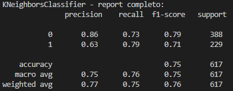
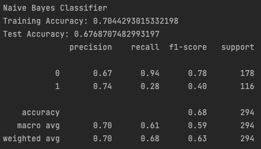
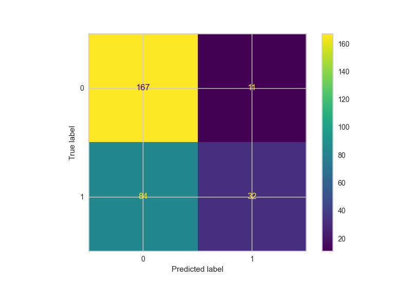
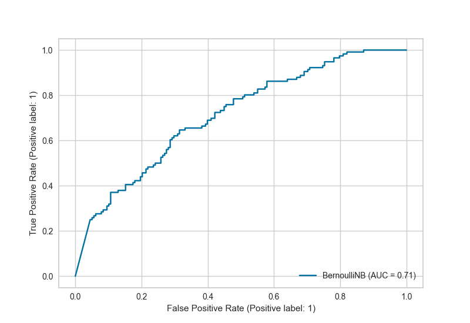
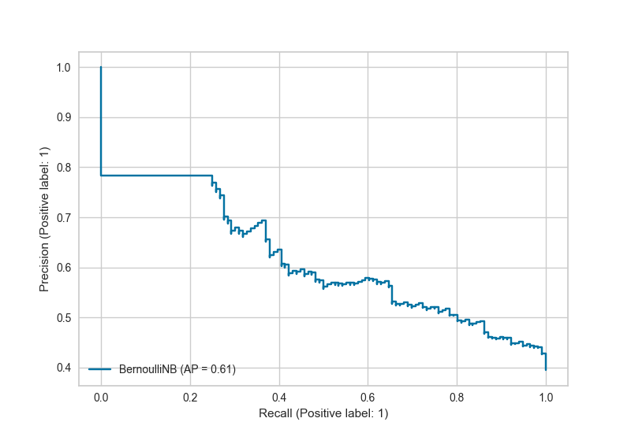
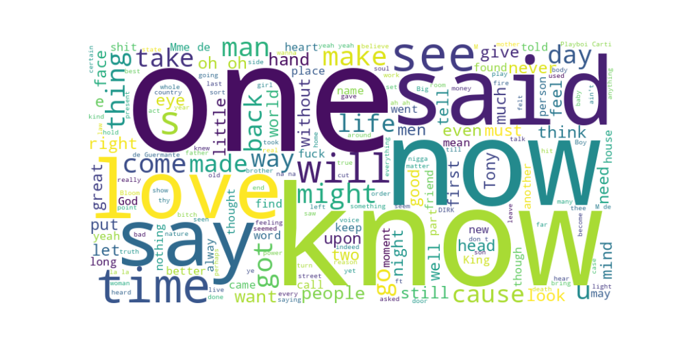

# Operazioni preliminari - salvataggio dei brani
L’obbiettivo è quello di salvare in un file csv le canzoni presenti nei brani preferiti nell’account di @michele dibisceglia. Innanzitutto sono stati recuperati dalla piattaforma spotify developer [https://developer.spotify.com/dashboard/1572e8f11a55483ba6336cc98058160e/settings](https://developer.spotify.com/dashboard/1572e8f11a55483ba6336cc98058160e/settings) `client_id`, `client_secret` e `redirect_uri` per poter effettuare la fase di autenticazione. Sono state create tre tabelle, collegate tra loro mediante gli id (come se fosse un database relazionale). rispettivamente, brani, artisti e album per una migliore organizzazione e congruenza dei dati. In una fase successiva del progetto, queste associazioni andranno fatte con Prolog. Utilizzando la funzione `current_user_saved_tracks()` e la funzione `audio_features(track_id)`, passandogli come parametro l’id di ogni brano, sono stati recuperati i seguenti dati:

- `track_id`: Spotify ID del brano;
- `track_added_at`: data e ora in cui il brano è stato salvato. Il timestamps è restituito in formato ISO 8601 come Coordinated Universal Time (UTC): YYYY-MM-DDTHH:MM:SSZ;
- `track_name`: nome del brano;
- `album_id`: album di appartenenza del brano;
- `main_artist_id`: artista principale del brano;
- `side_artists_id`: lista di artisti secondari che hanno partecipato nel brano;
- `track_duration`: durata in millisecondi del brano
- `track_explicit`: variabile booleana che indica se nel brano sono presenti riferimenti espliciti
- `track_popularity`: popolarità della traccia. Si tratta di un valore compreso tra 0 e 100, in cui 100 indica più popolare. La popolarità è calcolata tramite un algoritmo (interno di Spotify) ed è basato maggiormente, sul numero totale di riproduzioni del brano e su quanto sono recenti;
- `track_key`: La tonalità in cui si trova la traccia. Gli interi corrispondono alle tonalità utilizzando la notazione standard della Pitch Class. Ad esempio, 0 = C, 1 = C♯/D♭, 2 = D e così via. Se non è stata rilevata alcuna tonalità, il valore è -1.
- `track_bpm (*tempo*)`: Il tempo complessivo stimato di un brano in battiti al minuto (BPM). Nella terminologia musicale, il tempo è la velocità o il ritmo di un determinato brano e deriva direttamente dalla durata media dei battiti.
- `track_energy`: L'energia è una misura che va da 0,0 a 1,0 e rappresenta una misura percettiva dell'intensità e dell'attività. In genere, i brani energetici sono veloci, forti e rumorosi. Ad esempio, il death metal ha un'energia elevata, mentre un preludio di Bach ha un punteggio basso su questa scala. Le caratteristiche percettive che contribuiscono a questo attributo includono la gamma dinamica, il volume percepito, il timbro, la velocità di insorgenza e l'entropia generale.
- `track_danceability`: La ballabilità descrive quanto un brano sia adatto al ballo in base a una combinazione di elementi musicali, tra cui il tempo, la stabilità del ritmo, la forza del battito e la regolarità generale. Un valore di 0,0 è il meno ballabile e di 1,0 è il più ballabile.
- `track_happiness (*valence*)`: Una misura da 0,0 a 1,0 che descrive la positività musicale trasmessa da un brano. I brani con alta valenza suonano più positivi (ad esempio, felici, allegri, euforici), mentre quelli con bassa valenza suonano più negativi (ad esempio, tristi, depressi, arrabbiati).
- `track_loudness`: Il volume complessivo di una traccia in decibel (dB). I valori di loudness sono mediati sull'intero brano e sono utili per confrontare il volume relativo dei brani. Il loudness è la qualità di un suono che è il principale correlato psicologico della forza fisica (ampiezza). I valori sono tipicamente compresi tra -60 e 0 db.
- `track_acousticness`: Una misura di fiducia da 0,0 a 1,0 che indica se il brano è acustico. 1,0 rappresenta un'elevata fiducia che il brano sia acustico.
- `track_instrumentalness`: Prevede se un brano non contiene voci. I suoni "ooh" e "aah" sono considerati strumentali in questo contesto. I brani rap o parlati sono chiaramente "vocali". Più il valore di strumentalità è vicino a 1,0, maggiore è la probabilità che il brano non contenga contenuti vocali. I valori superiori a 0,5 sono intesi come tracce strumentali, ma la fiducia è maggiore man mano che il valore si avvicina a 1,0.
- `track_liveness`: Rileva la presenza di un pubblico nella registrazione. Valori di vivacità più alti rappresentano una maggiore probabilità che il brano sia stato eseguito dal vivo. Un valore superiore a 0,8 indica una forte probabilità che il brano sia dal vivo.
- `track_mode`: Il modo indica la modalità (maggiore o minore) di un brano, cioè il tipo di scala da cui deriva il suo contenuto melodico. Maggiore è rappresentato da 1 e minore da 0.
- `track_speechiness`: speechiness rileva la presenza di parole parlate in una traccia. Più la registrazione è esclusivamente di tipo parlato (ad esempio, talk show, audiolibri, poesie), più il valore dell'attributo è vicino a 1,0. I valori superiori a 0,66 descrivono tracce che probabilmente sono costituite interamente da parole parlate. I valori compresi tra 0,33 e 0,66 descrivono tracce che possono contenere sia musica che parlato, in sezioni o stratificati, compresi i casi di musica rap. I valori inferiori a 0,33 rappresentano molto probabilmente musica e altre tracce non simili al parlato.
- `track_time_signature`: Una firma temporale stimata. La firma temporale (metro) è una convenzione di notazione per specificare quante battute ci sono in ogni battuta (o misura). La firma temporale va da 3 a 7, indicando firme temporali da "3/4" a "7/4".

Una volta che sono stati recuperati tutti i brani preferiti, questi sono stati salvati nel file *saved_tracks_2023-07-22.csv*.

Per gli album invece, utilizzando la funzione `album(album_id)` sono stati recuperati i seguenti dati:

- `album_id`: ID Spotify dell’album
- `album_name`: nome dell’album
- `album_total_track`: numero di brano presenti nell’album
- `album_type`: tipo di album (sotto forma di stringa) i cui unici valori consentiti sono ‘*album*’, ‘*compilation*’ e ‘*single*’
- `album_label`: etichetta discografica che ha prodotto l’album
- `album_popularity`: popolarità dell’album. Il valore è compreso da 0 e 100 dove 100 indica maggiore popolarità.

Tra di dati che potevano essere recuperati tramite l’API era presente anche il campo `album_genres` il quale dovrebbe indicare il genere (o i generi) dell’album. Dopo una prima valutazione si è notato che questo campo facendo richiesta all’API viene sempre restituito vuoto, per questo motivo è stato omesso.

In ultimo, i dati degli artisti, recuperati utilizzando la funzione `artist(artist_id)` 

- `artist_id`: ID Spotify dell’artista
- `artist_name`: nome dell’artista
- `artist_followers`: numero di seguaci dell’artista
- `artist_genres`: generi musicali dell’artista
- `artist_popularity`: popolarità dell’artista. Il valore è compreso tra 0 e 100 dove 100 indica maggiore popolarità

Ciascuna delle tre tabelle, dopo aver eliminato eventuali righe duplicate, sono state salvate in file csv.

Successivamente, si è proceduto a raccogliere ulteriori dati in merito alle preferenze dell’utente, in particolare, in determinati periodi temporali, quali, ultimi 7 giorni, ultimi 30 giorni e da quando è stato registrato l’account, è stato possibile recuperare i **brani e gli artisti più ascoltati** nei tre periodi sopracitati. Per poter recuperare gli artisti più ascoltati è stata utilizzata la funzione `current_user_top_artists`, mentre per i brani più ascoltati `current_user_top_tracks`. Sono stati salvati in file csv separati differenziando i brani dagli artisti e rispettivamente i tre periodi. 

# Apprendimento non supervisionato - clustering degli artisti

Una volta che sono stati recuperati gli artisti, l’obiettivo è stato quello di trovare gli artisti simili tra di loro. Per fare ciò, sono stati considerati i generi musicali trattati dai singoli artisti e si è utilizzato l’algoritmo di **apprendimento non supervisionato DBSCAN** per poter definire dei cluster degli artisti. 

Dato che le colonne sono state ottenute tramite l'applicazione del `MultiLabelBinarizer` a etichette multiclasse, allora è possibile che si verifichino delle distribuzioni lontante da 0,5. Questo è comune quando si lavora con le trasformazioni multicasse in dati binari. La scelta dell'algoritmo di clustering DBSCAN è motivata dal fatto che questo sia noto per essere robusto alle distribuzioni irregolari. 

Il **DBSCAN** è un algoritmo di clustering che fa parte della categoria dei cosiddetti *density-based* perché non fa altro che individuare zone dello spazio delle *features* in cui la densità dei punti (o osservazioni) è maggiore. Tutte quelle osservazioni vicine tra loro vengono raggruppate in cluster. Quelle che invece sembrano isolate sono etichettate come *noise* o rumore. Il DBSCAN necessita di due iperparametri:
- **ε**: che corrisponde alla distanza all'interno della quale *ricercare* punti vicini
- **n**: che corrisponde al numero minimo di punti affiché si formi un *cluster*.
Possiamo dunque dire che il DBSCAN non fa altro che cercare tutti quei *cluster* i cui punti sono un numero maggiore o uguale ad **n** e distanti tra loro meno di **ε**.

Dato che il DBSCAN è un modello non supervisionato non gode di nessuna metrica per calcolare l'accuratezza. Tuttavia possiamo provare a ragionare per cercare un modo che ci aiuti ad individuare la miglior combinazione degli iperparametri per i nostri scopi. Il miglior modo per valutare le *performance* di un modello è osservare come cambiano le metriche al variare dei suoi iperparametri. Dato che il DBSCAN si preoccupa poco della forma del cluster l'utilizzo di una metrica come l'indice di Silhouette sarebbe inappropriato. Proprio per questo motivo possiamo provare a creare un paio di metriche home-made per avere contezza di come va la clusterizzazione con la combinazione degli iperparametri imposti. In particolare, ad ogni combinazione di iperparametri:

`0.1    5` - `0.1   10` - `0.1  15` - `1.9  45`

verrà eseguita prima la clusterizzazione e poi il calcolo delle metriche. Ad esempio, possiamo utilizzare:

- Distanza media tra i *noise points* e i 6 punti più vicini
- Numero di *cluster* che vengono individuati

Una volta ottenuti i risultati, si procede alla ricerca della "miglior combinazione" degli iperparametri:

Trattandosi di caratteristiche booleane, non potevano aspettarci risutlati differenti. Infatti, per valori superiori a 0.9 di ε tendiamo ad avere un solo cluster. Scegliamo allora **n = 5** e **ε = 0.3** che ci restituiscono mediamente dei noise points più distanti.

Nel contesto del DBSCAN, l'etichetta -1 è utilizzata per indicare punti che sono considerati rumore o outlier e che non sono stati assegnati a nessun cluster specifico. Questi punti non soddisfano i requisiti per essere classificati come core points o border points, quindi vengono considerati coem punti isolati o rumorosi. Questi punti potrebbero rappresentare anomalie o fluttuazioni casuali nei dati che non corrispondono a nessun cluster significativo. Quando si interpretano i risultati del clustering DBSCAN, è importante considerare sia i cluster etichettati positivamente che i punti etichettati con -1. Possono esserci situazioni in cui i punti rumorosi sono effettivamente importanti o rappresentano informazioni significative.

=======

# Creazione e Integrazione Knowledge Base

Come detto precedentemente, è stata creata una base di conoscenza utilizzando il linguaggio di programmazione logica Prolog, ed interfacciandosi in Python ad essa mediante la libreria pyswip. Con la creazioen della base di conoscenza e popolamentod di questa tramite fatti provenienti direttamente dalla WEB API di Spotify, la Knowledge Base è stata sfruttata per ingegnerizzare caratteristiche per l'apprendimento supervisionato

## Fatti
### Fatti sui brani
Sembra che tu stia cercando di descrivere una serie di fatti in Prolog che riguardano informazioni su canzoni, artisti e ascolti. Ecco una spiegazione e descrizione di ciascuno di questi fatti:

1. `nome_canzone(IdCanzone, NomeCanzone)`: Questo fatto associa un nome a una canzone identificata da `IdCanzone`. Ad esempio, potrebbe essere `nome_canzone(1, "Bohemian Rhapsody")`.

2. `popolarita(IdCanzone, Valore)`: Questo fatto rappresenta il livello di popolarità di una canzone identificata da `IdCanzone`. `Valore` è un valore numerico che indica la popolarità della canzone.

3. `tonalita(IdCanzone, Valore)`: Questo fatto indica la tonalità musicale di una canzone identificata da `IdCanzone`. `Valore` è una rappresentazione numerica della tonalità.

4. `bpm(IdCanzone, Valore)`: Questo fatto rappresenta il numero di battiti per minuto (BPM) di una canzone identificata da `IdCanzone`. `Valore` sarebbe un numero intero che indica il ritmo della canzone.

5. `energia(IdCanzone, Valore)`: Questo fatto rappresenta il livello di energia di una canzone identificata da `IdCanzone`. `Valore` è un valore numerico che riflette l'energia complessiva della canzone.

6. `acustica(IdCanzone, Valore)`: Questo fatto rappresenta il livello di strumentazione acustica in una canzone identificata da `IdCanzone`. `Valore` indica la fiducia nel fatto che il brano sia acustico

7. `strumentalita(IdCanzone, Valore)`: Questo fatto rappresenta il livello di presenza di parti strumentali in una canzone identificata da `IdCanzone`. `Valore` è un numero che indica la quantità di musica strumentale nella canzone.

8. `mode(IdCanzone, Valore)`: Questo fatto indica la modalità della canzone identificata da `IdCanzone`, che potrebbe essere "maggiore" o "minore".

9. `tempo(IdCanzone, Valore)`: Questo fatto rappresenta il tempo musicale della canzone identificata da `IdCanzone`, ad esempio "4/4" per un tempo comune.

10. `valenza(IdCanzone, Valore)`: Questo fatto rappresenta la valenza emotiva della canzone identificata da `IdCanzone`, ad esempio "felice", "triste", "rabbiosa", ecc.

11. `appartiene_album(IdCanzone, IdAlbum)`: Questo fatto collega una canzone identificata da `IdCanzone` a un album identificato da `IdAlbum`, indicando l'appartenenza della canzone all'album.

12. `ha_composto_album(IdArtista, IdAlbum)`: Questo fatto indica che un artista identificato da `IdArtista` ha composto tutte le canzoni dell'album identificato da `IdAlbum`.

13. `collaboratore_canzone(IdCanzone, IdArtista)`: Questo fatto rappresenta una collaborazione tra un artista identificato da `IdArtista` e una canzone identificata da `IdCanzone`.

14. `brano_ascoltato_freq_short(IdCanzone)`: Questo viene utilizzato per tenere traccia della frequenza di ascolto nel breve termine (una settimana) una canzone identificata da `IdCanzone`.

15. `brano_ascoltato_freq_mid(IdCanzone)`: Questo fatto viene utilizzato per tenere traccia della frequenza di ascolto medio nel medio termine (un mese) una canzone identificata da `IdCanzone`.

16. `brano_ascoltato_freq_long(IdCanzone)`: Questo fatto viene utilizzato utilizzato per tenere traccia della frequenza di ascolto nel lungo termine (da quando è stato creato l'account) una canzone identificata da `IdCanzone`.
### Fatti sugli artisti
1. `artista(IdArtista, NomeArtista)`: Questo fatto associa un nome a un artista identificato da `IdArtista`. Ad esempio, potrebbe essere `artista(1, "Queen")`.

2. `popolarita_artista(IdArtista, Valore)`: Questo fatto rappresenta il livello di popolarità di un artista identificato da `IdArtista`. `Valore` è un valore numerico che indica la popolarità dell'artista.

3. `genere_artista(IdArtista, Genere)`: Questo fatto indica il genere musicale di un artista identificato da `IdArtista`. `Genere` potrebbe è una stringa che rappresenta il genere musicale dell'artista.

4. `macro_categoria_artista(IdArtista, Categoria)`: Questo fatto rappresenta una macro-categoria o una descrizione generale dell'artista identificato da `IdArtista`. `Categoria` è essere una stringa che indica la categoria artistica a cui appartiene l'artista. E' il risultato del clustering effettuato precedentemente.

5. `artista_ascoltato_freq_short(IdArtista)`: Questo fatto viene utilizzato per tenere traccia della frequenza di ascolto nel breve termine (una settimana) dell'artista identificato da `IdArtista`.

6. `artista_ascoltato_freq_mid(IdArtista)`: Questo fatto viene utilizzato per tenere traccia della frequenza di ascolto nel medio termine (un mese) dell'artista identificato da `IdArtista`.

7. `artista_ascoltato_freq_long(IdArtista)`: Questo fatto viene utilizzato per tenere traccia della frequenza di ascolto nel lungo termine (da quando è stato creato l'account) dell'artista identificato da `IdArtista`.

8. `genere_ascoltato_freq(Genere, Valore)`: Questo fatto rappresenta la frequenza di ascolto di un genere musicale specifico `Genere`, con un valore numerico `Valore` che indica un peso per quel genere.
### Fatti sugli album
1. `album(IdAlbum, NomeAlbum)`: Questo fatto associa un nome a un album identificato da `IdAlbum`. Ad esempio, potrebbe essere `album(1, "The Game")`.

2. `uscita_album(IdAlbum, DataUscita)`: Questo fatto rappresenta la data di uscita di un album identificato da `IdAlbum`. `DataUscita` è una data nel formato desiderato (ad esempio, "yyyy-mm-dd") che indica quando l'album è stato rilasciato.
## Regole
1. `ha_composto_canzone(IdArtista,IdCanzone) :- appartiene_album(IdCanzone,IdAlbum), ha_composto_album(IdArtista,IdAlbum)`: Questa regola afferma che un artista identificato da `IdArtista` ha composto una canzone identificata da `IdCanzone` se quella canzone appartiene a un album composto dall'artista stesso.
2. `collaboratore_album(IdAlbum, IdArtista) :- collaboratore_canzone(IdCanzone, IdArtista), appartiene_album(IdCanzone, IdAlbum)`: Questa regola afferma che un artista identificato da `IdArtista` è un collaboratore in un album identificato da `IdAlbum` se l'artista ha collaborato a una canzone contenuta in quell'album.
3. `hanno_collaborato_album(IdArtista1,IdArtista2,IdAlbum) :- IdArtista1 \== IdArtista2, collaboratore_album(IdAlbum, IdArtista2), ha_composto_album(IdAlbum, IdArtista1)`: Questa regola indica che due artisti diversi, `IdArtista1` e `IdArtista2`, hanno collaborato a un album identificato da `IdAlbum` se l'artista `IdArtista1` ha composto l'album e l'artista `IdArtista2` è un collaboratore dell'album.
4. `hanno_collaborato_canzone(IdArtista1, IdArtista2, IdCanzone) :- IdArtista1 \== IdArtista2, collaboratore_canzone(IdCanzone, IdArtista2), ha_composto_canzone(IdArtista1, IdCanzone)`: Queste regole gestiscono diverse situazioni di collaborazione tra artisti su una canzone identificata da `IdCanzone`.
5. `hanno_collaborato_canzone(IdArtista1, IdArtista2, IdCanzone) :- IdArtista1 \== IdArtista2, collaboratore_canzone(IdCanzone, IdArtista1), ha_composto_canzone(IdArtista2, IdCanzone)`: vedi sopra
6. `hanno_collaborato_canzone(IdArtista1, IdArtita2, IdCanzone) :- IdArtista1 \== IdArtista2, collaboratore_canzone(IdCanzone, IdArtista1), collaboratore_canzone(IdCanzone, IdArtista2)`: vedi sopra
7. `simile_struttura_musicale(IdCanzone1,IdCanzone2) :- IdCanzone1 \== IdCanzone2, tonalita(IdCanzone1, Tonalita), tonalita(IdCanzone2, Tonalita), tempo(IdCanzone1, Tempo), tempo(IdCanzone2, Tempo), bpm(IdCanzone1, Bpm1), bpm(IdCanzone2,Bpm2), abs(Bpm1 - Bpm2) =< 15`: Questa regola afferma che due canzoni, `IdCanzone1` e `IdCanzone2`, hanno una struttura musicale simile in base a parametri come tonalità, tempo e BPM.
8. `simili_emozioni(IdCanzone1, IdCanzone2) :- IdCanzone1 \== IdCanzone2, energia(IdCanzone1, Energia1), energia(IdCanzone2, Energia2), valenza(IdCanzone1, Valenza1), valenza(IdCanzone2, Valenza2), abs(Energia1 - Energia2) =< 20, abs(Valenza1 - Valenza2) =< 0.3`: Questa regola afferma che due canzoni, `IdCanzone1` e `IdCanzone2`, hanno emozioni simili in base a parametri come energia e valenza.
9. `stesso_artista(IdCanzone1,IdCanzone2) :- IdCanzone1 \== IdCanzone2, ha_composto_canzone(IdArtista, IdCanzone1), ha_composto_canzone(IdArtista, IdCanzone2)`: Questa regola afferma che due canzoni, `IdCanzone1` e `IdCanzone2`, sono state composte dallo stesso artista.
10. `stesso_album(IdCanzone1,IdCanzone2) :- IdCanzone1 \== IdCanzone2, appartiene_album(IdCanzone1,IdAlbum), appartiene_album(IdCanzone2, IdAlbum)`: Questa regola afferma che due canzoni, `IdCanzone1` e `IdCanzone2`, appartengono allo stesso album.
11. `stesso_genere_artista(IdArtista1, IdArtista2) :- IdArtista1 \== IdArtista2, genere_artista(IdArtista1,Genere), genere_artista(IdArtista2,Genere)`: Questa regola afferma che due artisti, `IdArtista1` e `IdArtista2`, appartengono allo stesso genere musicale.
12. `collaborazione_successiva_album(IdArtista,IdAlbum,IdAlbum2) :- artista(IdArtista,NomeArtista), collaboratore_canzone(IdCanzone,Collaboratori), sub_atom(Collaboratori,_,_,_,NomeArtista), appartiene_album(IdCanzone,IdAlbum2), uscita_album(IdAlbum, DataUscita), uscita_album(IdAlbum2,DataUscita2), DataUscita < DataUscita2`: Questa regola verifica se un artista ha collaborato a un album successivo.
13. `collaborazione_precedente_album(IdArtista,IdAlbum,IdAlbum2) :- artista(IdArtista,NomeArtista), collaboratore_canzone(IdCanzone,Collaboratori), sub_atom(Collaboratori,_,_,_,NomeArtista), appartiene_album(IdCanzone,IdAlbum2), uscita_album(IdAlbum, DataUscita), uscita_album(IdAlbum2,DataUscita2), DataUscita > DataUscita2`: Questa regola verifica se un artista ha collaborato a un album precedente.
14. `artista_ascoltato_freq(IdArtista) :- artista_ascoltato_freq_short(IdArtista, _); artista_ascoltato_freq_mid(IdArtista, _); artista_ascoltato_freq_long(IdArtista, _)`: Questa regola verifica se un artista è stato ascoltato, considerando diverse frequenze di ascolto.
15. `brano_ascoltato_freq(IdCanzone) :- brano_ascoltato_freq_short(IdCanzone, _); brano_ascoltato_freq_mid(IdCanzone, _); brano_ascoltato_freq_long(IdCanzone, _)`: Questa regola verifica se una canzone è stata ascoltata, considerando diverse frequenze di ascolto.
16. `artista_singolare_importante(IdArtista) :- macro_categoria_artista(IdArtista, Categoria), popolarita_artista(IdArtista, Valore), Categoria = \"-1\", Valore > 70`: Questa regola verifica se un artista ha una popolarità significativa ed è classificato come "singolare" in termini di macro-categoria.

# Modelli di apprendimento per la classificazione e valutazione
## Introduzione
Considerando sia le caratteristiche originali che quelle ingegnerizzate, l'obbiettivo dei modelli di apprendimento supervisionato è quello di prevedere quali brani, all'interno delle playlist, possono essere più coerenti con le preferenze musicali dell'utente, allo scopo ultimo di creare playlist personalizzate su misura per lui.

I modelli di apprendimento automatico si basano principalmente su features numeriche e booleane, queste ultime rappresentate tramite una mappatura su valori binari (0 e 1). Le features categoriche sono invece molto limitate.

Nello specifico, per il processo di apprendimento sono state impegnate le librerie Python Scikit Learn, utilizzando i seguenti algoritmi: 

1. **k-Nearest Neighbors (k-NN)**: Questo algoritmo consente di individuare i brani il cui profilo musicale è meno distante da quelli preferiti dall'utente. Si basa sul principio che brani simili tendono a condividere caratteristiche simili.
2. **Decision Tree Classifier**: Questo modello di apprendimento automatico sfrutta un albero decisionale per classificare i brani in base alle loro caratteristiche numeriche. È in grado di gestire efficacemente dati numerici e può essere particolarmente robusto anche in presenza di dati rumorosi.
3. **Random Forest**: Questo algoritmo si basa su un insieme di alberi decisionali e sfrutta il principio dell'aggregazione per migliorare la precisione delle previsioni. È particolarmente adatto per gestire caratteristiche numeriche e può gestire grandi quantità di dati in modo efficiente.
4. **Gradient Boosting Classifier**: Questo modello sfrutta una serie di alberi decisionali, ognuno dei quali cerca di correggere gli errori dei modelli precedenti. Attraverso iterazioni successive, il modello si adatta meglio ai dati di addestramento, fornendo previsioni più accurate.
5. **Logistic Regression**: La Regressione Logistica è un algoritmo di classificazione che utilizza una funzione logistica per stimare la probabilità che un'istanza appartenga a una determinata classe. Nonostante il nome, è utilizzato per problemi di classificazione binaria e può essere esteso per affrontare problemi multiclasse. L'algoritmo cerca di trovare un iperpiano che meglio separa le diverse classi nello spazio delle caratteristiche.
6. **Support Vector Machine (SVM)**: SVM è un algoritmo di apprendimento supervisionato che mira a trovare l'iperpiano ottimale che separa le diverse classi massimizzando il margine tra di esse. Può gestire sia problemi di classificazione che di regressione. Gli esempi di addestramento più vicini al margine di separazione sono chiamati "vettori di supporto". SVM può anche sfruttare il trucco del kernel per trasformare lo spazio delle caratteristiche, rendendolo adatto a problemi non linearmente separabili.
7. **AdaBoost**: AdaBoost è un algoritmo di boosting che costruisce un modello forte combinando una serie di modelli deboli (spesso alberi decisionali). In ogni iterazione, l'algoritmo dà maggior peso agli esempi classificati erroneamente in precedenza, concentrandosi su di essi per costruire un modello successivo migliore. Alla fine, i modelli deboli vengono ponderati e combinati in un modello complessivo che ha dimostrato di avere buone prestazioni predittive.
8. **Multi-Layer Percepton Classifier**: L'MLP Classifier è una rete neurale artificiale composta da uno o più strati di neuroni, ognuno dei quali è connesso a tutti i neuroni degli strati adiacenti. È un modello flessibile in grado di affrontare problemi di classificazione complessi. Gli strati intermedi, chiamati strati nascosti, consentono all'MLP di catturare rappresentazioni gerarchiche dei dati. L'addestramento avviene attraverso la retropropagazione dell'errore, in cui i pesi delle connessioni vengono aggiornati per ridurre l'errore di predizione.

L'utilizzo di tali algoritmi consente di ottenere modelli predittivi robusti e in grado di elaborare le caratteristiche numeriche delle tracce musicali, contribuendo così alla creazione di playlist personalizzate che riflettano le preferenze dell'utente in modo accurato ed efficace. 

## KNN
Per il problema specifico di prevedere la feature target "PREFERITO" basandosi sulle caratteristiche numeriche e booleane dei profili dei brani musicali, è stato utilizzato il metodo k-Nearest Neighbors (k-NN) come primo algoritmo di apprendimento automatico.

Il k-NN è un algoritmo di classificazione che si basa sull'idea che gli oggetti simili tendono ad essere vicini l'uno all'altro nello spazio delle caratteristiche. Nel contesto musicale, le caratteristiche numeriche e booleane dei profili dei brani musicali sono utilizzate per rappresentare ciascun brano.

Il processo di addestramento del k-NN coinvolge la creazione di un insieme di dati di addestramento contenente i profili dei brani musicali e le relative etichette "PREFERITO". Successivamente, viene definito un insieme di dati di test per valutare le prestazioni del classificatore.

Durante la fase di previsione, per ogni brano del set di dati di test, il k-NN calcola le distanze tra il profilo del brano di test e i profili dei brani di addestramento. I k brani più vicini al brano di test vengono selezionati in base alle distanze calcolate.

Il parametro k nel k-NN rappresenta il numero di vicini più prossimi considerati per prendere una decisione di classificazione. Variazioni nel parametro k possono influenzare le prestazioni del classificatore. Pertanto, sono state effettuate diverse valutazioni delle prestazioni del classificatore utilizzando valori diversi di k.

La valutazione delle prestazioni del classificatore è stata eseguita misurando le metriche di valutazione come l'accuratezza, la precisione, il recall e l'F1-score, al variare del parametro k. Ciò ha permesso di identificare il valore di k che produceva le prestazioni migliori per il problema specifico.

In sintesi, il k-Nearest Neighbors è stato utilizzato per prevedere la feature target "PREFERITO" basandosi sulle caratteristiche numeriche e booleane dei profili dei brani musicali. Sono state eseguite valutazioni delle prestazioni al variare del parametro k per determinare il valore ottimale che massimizzasse le prestazioni del classificatore.

La tabella riporta i valori delle metriche di valutazione mentre il grafico illustra le prestazioni del modello al variare del parametro k. La linea blu rappresenta l'andamento della curva dell'accuratezza per i dati di addestramento, mentre la linea rossa indica l'andamento dell'accuratezza per i dati di test. 

L'accuratezza è una misura che indica la percentuale di previsioni corrette fatte dal modello. Nel grafico, l'asse x rappresenta i diversi valori di k utilizzati, mentre l'asse y rappresenta l'accuratezza del modello.

L'andamento della curva dell'accuratezza per i dati di addestramento (linea blu) mostra come le prestazioni del modello variano al variare di k. Questa curva può fornire informazioni sul comportamento del modello in relazione alla complessità del problema. Ad esempio, se l'accuratezza aumenta all'aumentare di k fino ad un certo punto e poi diminuisce, potrebbe indicare che un valore moderato di k è ideale per il modello.

L'andamento dell'accuratezza per i dati di test (linea rossa) indica come il modello si generalizza su nuovi dati, al variare di k. L'obbettivo è ottenere un'accuratezza elevata sia sui dati di addestramento che sui dati di test, indicando che il modello ha appreso in modo efficace e può generalizzare bene sui nuovi dati. 

L'analisi della curva dell'accuratezza per i dati di addestramento e di test può aiutare a identificare il valore ottimale di k che massimizza le prestazioni del modello senza incorrere in problemi di underfitting o overfitting.

In conclusione, la tabella riporta le metriche di valutazioni dei modelli mentre il grafico fornisce un'indicazione visiva delle prestazioni del modello al variare del paramentro k, evidenziando l'andamento dell'accuratezza per i dati di addestramento e di test. 

La matrice di confusione è uno strumento utilizzato per valutare le prestazioni di un modello di classificazione, consentendo di comprendere quanto bene il modello sia in grado di classificare correttamente le diverse categorie di dati. La matrice di confusione visualizza le previsioni del modello rispetto ai veri valori di classe dei dati. Essa è composta da una griglia in cui le righe rappresentano le classi effettive dei dati, mentre le colonne rappresentano le classi previste dal modelo. Per una classificazione binaria, abbiamo una matrice 2x2 con quattro possibili combinazioni:

1. `Veri positivi (TP)`: questi sono i casi in cui il modello ha correttamente previsto la classe positiva.
2. `Falsi positivi (FP)`: questi sono i casi in cui il modello ha erroneamente previsto la classe positiva quando la classe reale era negativa (errore di tipo I).
3. `Veri negativi (TN)`: questi sono i casi in cui il modello ha correttamente previsto la classe negativa.
4. `Falsi negativi (FN)`: questi sono i casi in cui il modello ha erroneamente previsto la classe negativa quando la classe reale era positiva (errore di tipo II).

La dispoisizione di questi valori nella matrice di confusione ci aiuta a comprendere le performance del modello da cui è possibile calcolare le diverse metriche già presenti nella tabella quali `Accuracy`, `Recall`, `Precision`, `F1-Score`. 

Una curva di ROC (Receiver Operating Characteristic) è uno strumento grafico utilizzato per valutare le prestazioni di un classificatore binario in diversi livelli di soglia decisionale. In altre parole, la curva ROC è impiegata per valutare quanto bene un modello sia in grado di distinguere tra le due classi variando il punto di taglio che determina quale classe asseganre a un'instanza di input. 

L'utilità della curva di ROC è nella capacità di fornire una visualizzazione completa delle prestazioni di un modello di classificazione in diversi livelli di soglia. Inotre, l'area sotto la curva di ROC (AUC-ROC) viene utilizzata come metrica aggregata per valutare globalmente le prestazioni di un modello: un AUC-ROC maggiore indica generalemnte un modello migliore. 

## Decision Tree Classifier
Per la valutazione degli alberi di decisione, è stata adottata una procedura di k-fold cross-validation con un valore di k pari a 5. Questo approccio permette di valutare le prestazioni del classificatore utilizzando diverse suddivisioni del set di dati di addestramento e di validazione, riducendo il rischio di ottenere valutazioni sbilanciate o influenzate dalla particolare divisione dei dati.

Durante la fase di addestramento degli alberi di decisione, sono state considerate sempre le stesse caratteristiche per la previsione del target preferito. La scelta di utilizzare le stesse caratteristiche per tutti gli alberi consente di confrontare in modo equo le prestazioni dei modelli al variare di altri parametri, come ad esempio la profondità massima raggiunta dall'albero.

La profondità massima dell'albero è un parametro chiave che influisce sulle prestazioni del modello. Durante la valutazione, sono state misurate le prestazioni del classificatore utilizzando diverse profondità, al fine di individuare il punto ottimale in cui il modello fornisce le migliori prestazioni.

Per quanto riguarda il criterio di selezione utilizzato per la costruzione dell'albero, è stata scelta la misura di "entropy". L'entropy è una misura della disordine o dell'incertezza all'interno di un set di dati e rappresenta la quantità di informazione contenuta nei dati.

Si precisa che non sono state riscontrate differenze significative in termini di prestazioni utilizzando "entropy" rispetto ad altre misure come "log_loss" o "gini". Questo suggerisce che i risultati ottenuti utilizzando l'entropy come criterio di selezione sono comparabili a quelli ottenuti con altre misure e che l'entropy rappresenta una scelta valida per la costruzione dell'albero di decisione in questo contesto.

Complessivamente, l'approccio utilizzato per valutare gli alberi di decisione ha coinvolto l'addestramento di modelli con diverse profondità massime e l'utilizzo del criterio di selezione "entropy". La valutazione è stata effettuata mediante k-fold cross-validation con un valore di k pari a 5, al fine di ottenere una stima robusta delle prestazioni dei modelli.

Le tre caratteristiche con il valore maggiore sono:
`track_popularity`: 0.401
`artista_ascoltato_freq`: 0.188
`stesso_album_brano_asc_freq`: 0.127

## Random Forest Classifier
Per l'addestramento del modello di apprendimento automatico, è stato utilizzato l'algoritmo di Random Forest. Durante la fase di sperimentazione, è stata esaminata l'accuratezza del modello al variare del numero di alberi appresi e della profondità massima degli alberi, effettuando una valutazione mediante k-fold cross-validation con un valore di k pari a 5.

Nel caso specifico, si è osservato che non vi è stata alcuna significativa variazione dell'accuratezza al variare del numero di alberi appresi, mantenendo una profondità massima di default pari a 5. Questo indica che l'aumento del numero di alberi non ha portato a un miglioramento sostanziale delle prestazioni del modello in termini di accuratezza.

Tuttavia, si è rilevato che la valutazione del modello è stata più significativa al variare della profondità massima degli alberi, mantenendo il valore di default per il numero di alberi appresi. Questo significa che la modifica della profondità massima degli alberi ha avuto un impatto più significativo sull'accuratezza del modello rispetto al numero di alberi utilizzati.

La profondità massima degli alberi rappresenta il numero massimo di divisioni o domande che l'algoritmo può fare durante la costruzione di ciascun albero. Aumentare la profondità massima può consentire al modello di catturare relazioni più complesse nei dati di addestramento, ma potrebbe anche aumentare il rischio di overfitting, in cui il modello si adatta troppo ai dati di addestramento e non generalizza bene sui dati di test. 

In sintesi, nell'esperimento condotto con l'algoritmo Random Forest, si è rilevato che il numero di alberi appresi non ha avuto un impatto significativo sull'accuratezza del modello, mentre la variazione della profondità massima degli alberi ha avuto un effetto più rilevante. Queste osservazioni indicano l'importanza di valutare attentamente i parametri degli algoritmi di apprendimento automatico per ottenere i migliori risultati in termini di prestazioni del modello.

Le tre caratteristiche con il valore maggiore sono:
`track_happiness`: 0.057
`track_danceability`: 0.054
`artista_ascoltato_freq`: 0.092

## Gradient Boosting Classifier
Anche in questo caso si è sperimento sulla base del numero di alberi utilizzati per l'apprendimento nel modello di boosting, effettuando la valutazione utilizzando in k-fold cross-validation.

Le tre caratteritiche più importanti per il modello sono:
`track_popularity`: 0.393
`brano_ascoltato_freq`: 0.131
`artista_ascoltato_freq`: 0.082

## Ada Boosting Classifier
Per affrontare il problema di prevedere la feature target "PREFERITO" utilizzando le caratteristiche dei profili dei brani musicali, è stato impiegato l'algoritmo AdaBoost, un metodo di apprendimento automatico che mira a costruire un modello di previsione potente combinando una serie di modelli più deboli.

L'AdaBoost opera in più fasi iterative, in ognuna delle quali viene addestrato un modello debole, spesso costituito da un albero decisionale semplice. Inizialmente, ogni istanza di addestramento ha lo stesso peso nell'addestramento del modello. Dopo ogni iterazione, il peso delle istanze classificate erroneamente viene aumentato, in modo che il modello successivo dia maggiore importanza a quelle istanze che sono state previste erroneamente in passate iterazioni.

Alla fine del processo di addestramento, i modelli deboli vengono combinati attribuendo pesi alle loro previsioni in base alle loro prestazioni. I modelli che si sono dimostrati migliori nel prevedere correttamente le istanze difficili (quindi quelle con errori precedenti più elevati) ricevono un peso maggiore.

Durante la fase di previsione, il modello AdaBoost combina le previsioni dei modelli deboli ponderandole secondo i pesi assegnati. L'output complessivo rappresenta la previsione finale del modello AdaBoost per ciascuna istanza.

Le prestazioni dell'algoritmo sono valutate utilizzando metriche di valutazione come l'accuratezza, la precisione, il recall e l'F1-score al variare del numero di alberl utilizzati e utilizzando la k-fold cross-validation con k pari a 5 per ottenere le metriche di valutazione. AdaBoost si adatta dinamicamente alle istanze più complesse nel processo di apprendimento, consentendo di gestire efficacemente anche dati rumorosi o complessi.

In sintesi, AdaBoost è stato scelto per prevedere la feature target "PREFERITO" basandosi sulle caratteristiche numeriche e booleane dei profili dei brani musicali. Attraverso iterazioni successive, AdaBoost crea un modello complesso combinando modelli deboli, concentrandosi sulle istanze più difficili da classificare. Le valutazioni delle prestazioni del modello consentono di valutare l'efficacia delle sue previsioni rispetto ai risultati attesi.

Le tre caratteristiche con il valore maggiore sono:
`track_popularity`: 0.300
`track_danceability`: 0.100
`track_happiness`: 0.100

## Regressione Logistica
La Regressione Logistica è un approccio di classificazione che si basa sulla stima delle probabilità di appartenenza a una determinata classe. Nel contesto musicale, le caratteristiche numeriche e booleane dei profili dei brani musicali sono utilizzate per rappresentare ogni brano.

Il processo di addestramento della Regressione Logistica coinvolge la creazione di un insieme di dati di addestramento contenente i profili dei brani musicali e le etichette corrispondenti "PREFERITO". Successivamente, l'algoritmo ricerca i pesi ottimali da assegnare a ciascuna caratteristica al fine di modellare al meglio la relazione tra le caratteristiche e la probabilità di appartenenza alla classe "PREFERITO".

Durante la fase di previsione, per ogni brano nel set di dati di test, la Regressione Logistica calcola le probabilità stimare di appartenenza alla classe "PREFERITO" basandosi sulle sue caratteristiche. Tipicamente, si utilizza una soglia di probabilità per classificare ciascun brano come "PREFERITO" o "non PREFERITO".

La performance dell'algoritmo è valutata utilizzando metriche come l'accuratezza, la precisione, il recall e l'F1-score al variare dell'iperparametro C (*inverse of regularization strength*) il quale controlla la forza della regolarizzazione. Valori più piccoli di C aumentano la regolarizzazione, mentre valori più grandi lo riducono. La regolarizzazione aiuta a prevenire l'overfitting. Le metriche sono state ottenute utilizzando la k-fold cross-validation con valore di k pari a 5.

In sintesi, la Regressione Logistica è stata impiegata per prevedere la feature target "PREFERITO" attraverso l'analisi delle caratteristiche numeriche e booleane dei profili dei brani musicali. La fase di addestramento mira a determinare i pesi ottimali per le caratteristiche al fine di modellare al meglio la relazione con la classe target. Le prestazioni del modello sono valutate utilizzando diverse metriche per misurare la sua capacità di fare previsioni accurate.

Vengono riportati i pesi delle caratteristiche utilizzati dal modello:

`{
    "track_duration": -0.3471949955999086,
    "track_explicit": 0.17765477459599102,
    "track_popularity": -2.036064637740493,
    "track_bpm": -0.05995951702892066,
    "track_energy": 0.8162847725084367,
    "track_danceability": -2.9714748149020096,
    "track_happiness": -1.071193639189755,
    "track_loudness": -1.582296748849031,
    "track_acousticness": 1.1477091309831227,
    "track_instrumentalness": 1.6582132454134035,
    "track_liveness": 0.3010794884524378,
    "track_speechiness": 2.1986637553955113,
    "brano_ascoltato_freq": 4.927249808637551,
    "artista_ascoltato_freq": 1.5844991106155788,
    "artista_singolare_importante": 0.7086523906700236,
    "coll_artista_asc_freq": 0.843820769792108,
    "sim_struttura_musicale_brano_asc_freq": -0.19243919759544595,
    "sim_emozioni_brano_asc_freq": 0.11334237281992378,
    "macro_categoria_artista_asc_freq": 0.592018876632656,
    "genere_asc_freq": -0.5804625632925503,
    "ha_composto_canzone": 0.03474143481260827,
    "stesso_genere_artista_asc_freq": 0.4168891157323032,
    "stesso_album_brano_asc_freq": 0.18550824285384265,
    "stesso_artista_brano_asc_freq": 0.1912155369558048,
    "brano_freq_importante": 0.0,
    "artista_freq_importante": 0.33392863953844076,
    "coll_artista_freq_imp": 1.112606631188687,
    "macro_categoria_artista_freq_imp": 0.7093357891938745,
}`

## SVM 
E' stato utilizzato l'algoritmo di Support Vector Machine (SVM) per affrontare il problema di classificazione. L'SVM è un potente algoritmo di machine learning che mira a trovare l'iperpiano ottimale nello spazio delle caratteristiche per separare le diverse classi dei dati. In questo caso specifico, l'obiettivo è prevedere la feature target "PREFERITO" basandosi sulle caratteristiche numeriche e booleane dei profili dei brani musicali.

Per l'ottimizzazione dei parametri dell'SVM, è stato utilizzato un processo di ricerca esaustiva dei parametri ottimali. L'intervallo dei possibili valori di C e gamma è stato definito attraverso la creazione di scale logaritmiche che coprono una vasta gamma di valori. Questa gamma di valori permette all'algoritmo di esplorare diverse combinazioni di parametri e selezionare quelli che massimizzano le prestazioni predittive.

Il metodo di cross-validation StratifiedShuffleSplit è stato applicato per suddividere il dataset in cinque insiemi di addestramento e test mantenendo la distribuzione delle classi bilanciata. Questo è fondamentale per evitare la sovradeterminazione dei dati e ottenere stime accurate delle prestazioni dell'algoritmo.

La GridSearchCV è stata utilizzata per eseguire una ricerca esaustiva su tutte le possibili combinazioni di parametri definiti nell'intervallo. Per ogni combinazione di parametri, l'SVM è stato addestrato e valutato utilizzando la cross-validation. Alla fine della ricerca, il modello SVM con i parametri che hanno prodotto le migliori prestazioni è stato selezionato come il modello ottimale.

Nell'output del codice, vengono stampati i parametri ottimali trovati insieme al punteggio corrispondente. Questo punteggio rappresenta l'accuratezza media ottenuta durante la cross-validation utilizzando il modello SVM ottimale.

I parametri migliori sono `{'C': 0.1, 'gamma': 1, 'kernel': 'poly'}` con lo score di `0.72`

In sintesi, l'algoritmo di Support Vector Machine (SVM) è stato utilizzato per prevedere la feature target "PREFERITO" basandosi sulle caratteristiche numeriche e booleane dei profili dei brani musicali. Attraverso una ricerca esaustiva dei parametri ottimali e l'uso della cross-validation, è stato selezionato il modello SVM con i parametri che hanno prodotto le migliori prestazioni in termini di accuratezza.

## MLPClassifier
E' stato impiegato l'algoritmo di classificazione Multi-Layer Perceptron (MLPClassifier) per risolvere un problema di classificazione. L'MLPClassifier è una rete neurale artificiale con strati multipli di neuroni che utilizza l'approccio di apprendimento profondo per modellare relazioni complesse tra le caratteristiche del dataset.

Per ottimizzare le prestazioni dell'MLPClassifier, sono state definite diverse combinazioni di parametri. Questi parametri includono le dimensioni dei layer nascosti, la funzione di attivazione, l'ottimizzatore e il parametro di regolarizzazione alpha. Inoltre, è stata definita una versione con distribuzione casuale dei parametri.

È stato creato un classificatore MLP (Multi-Layer Perceptron) con l'obiettivo di addestrare una rete neurale per la classificazione. Il numero massimo di iterazioni è stato impostato a 10000, e il seed random è stato fissato a 42 per garantire riproducibilità nei risultati.

È stata effettuata una ricerca dei parametri ottimali utilizzando due approcci differenti: una ricerca a griglia (`GridSearchCV`) e una ricerca casuale (`RandomizedSearchCV`). Entrambi gli approcci utilizzano la cross-validation per valutare le prestazioni del modello.

Nella ricerca a griglia, vengono valutate tutte le possibili combinazioni dei parametri. Nella ricerca casuale, invece, vengono eseguite 10 iterazioni con combinazioni casuali di parametri.

Dopo le ricerche, vengono stampati i parametri ottimali e il punteggio di validazione incrociata migliore ottenuto da ciascuna ricerca.

Ricerca a griglia - `Best Parameters: {'activation': 'tanh', 'alpha': 0.01, 'hidden_layer_sizes': (50, 50), 'solver': 'adam'}`
Ricerca a griglia - `Best Cross-Validation Score: 0.7724183583406884`
Ricerca Casuale - `Best Parameters: {'activation': 'relu', 'alpha': 0.003924619912671627, 'hidden_layer_sizes': (50,), 'solver': 'adam'}`
Ricerca Casuale - `Best Cross-Validation Score: 0.7542722649518767`

In sintesi, l'algoritmo MLPClassifier è stato impiegato per risolvere il problema di classificazione basato sulle caratteristiche dei dati. Sono state eseguite ricerche dei parametri ottimali sia attraverso una ricerca a griglia che una ricerca casuale, entrambe utilizzando la cross-validation. I parametri ottimali e i punteggi di validazione incrociata forniscono informazioni sulla configurazione dei parametri che massimizzano le prestazioni del modello MLPClassifier.

## Valutazione
1. **MLPClassifier**:
   - Anche se l'accuratezza del 80% sembra ragionevole, è evidente che il modello soffre di una discrepanza significativa tra precisione e richiamo per entrambe le classi. Mentre la precisione è ragionevolmente bilanciata, il richiamo per la classe 0 è notevolmente più basso rispetto al richiamo della classe 1. Ciò indica che il modello sta facendo un buon lavoro nell'identificare i campioni positivi, ma sta perdendo molti dei campioni negativi.

2. **SVC**:
   - La precisione del 75% potrebbe essere accettabile, ma il richiamo per la classe 0 è deludente, indicando che il modello sta perdendo molti dei campioni di questa classe.

3. **LogisticRegression**:
   - I risultati sono simili a quelli del modello SVC, con una precisione del 76% e una discrepanza tra precisione e richiamo per la classe 0. Anche qui, il modello mostra una tendenza a mancare di sensibilità per la classe 0.

4. **AdaBoostClassifier**:
   - Anche se l'accuratezza del 79% sembra ragionevole, la discrepanza tra precisione e richiamo per la classe 0 rimane un problema. Il modello sembra meglio bilanciato rispetto ai precedenti, ma potrebbe ancora mancare di robustezza nella classificazione della classe 0.

5. **GradientBoostingClassifier**:
   - I risultati sono molto simili a quelli del MLPClassifier. L'accuratezza del 80% è decente, ma la discrepanza tra precisione e richiamo per la classe 0 potrebbe indicare la presenza di un problema simile di mancanza di sensibilità.

6. **RandomForestClassifier**:
   - Con un'accuratezza del 80%, questo modello sembra ragionevolmente bilanciato tra precisione e richiamo per entrambe le classi. Tuttavia, la precisione per la classe 1 è ancora inferiore rispetto alla classe 0, indicando una certa difficoltà nel riconoscere correttamente i campioni positivi.

7. **DecisionTreeClassifier**:
   - Anche se l'accuratezza è del 79%, la discrepanza tra precisione e richiamo per la classe 0 rimane un problema. Questo modello potrebbe essere sensibile all'overfitting, poiché la differenza tra precisione e richiamo suggerisce che potrebbe essere incline a classificare erroneamente alcuni campioni.

8. **KNeighborsClassifier**:
   - La precisione bilanciata e la discrepanza ragionevolmente bassa tra precisione e richiamo indicano che questo modello sta svolgendo un lavoro equilibrato nella classificazione delle classi. Tuttavia, l'accuratezza complessiva del 75% potrebbe essere ulteriormente migliorata.

In realtà, considerato il contesto dell'applicazione e considerato l'obbiettivo finale, la discrepanza è utile per avere una maggiore generalizzazione dei brani da consigliare all'utente.

# Apprendimento supervisionato - classificazione del testo delle tracce
La classificazione dei testi delle canzoni in base alle preferenze degli utenti è un'applicazione rilevante nell'ambito dell'analisi dei dati e dell'apprendimento automatico. Nel nostro caso di studio abbiamo voluto implementare un algoritmo di apprendimento supervisionato basato sulla teoria della probabilità chiamato Bernoulli Naive Bayes. Bernoulli Naive Bayes utilizza il Teorema di Bayes per calcolare le probabilità di appartenenza di un'istanza a una determinata classe, dato il vettore delle feature binarie. Questo approccio è spesso utilizzato in problemi di classificazione di testi, come la categorizzazione di documenti in categorie specifiche, rilevazione di spam nelle email, analisi dei sentimenti nei testi e molto altro. Nel nostro caso di studio è stato utilizzato per categorizzare i testi delle canzoni di Spotify in due classi: 1 (Piace), 0 (Non piace).
Per la raccolta dei testi è stata utilizzata l'API di Genius,  Genius è noto per ospitare testi di canzoni, annotazioni e informazioni correlate alle canzoni, inclusi dettagli sugli artisti e il loro significato.
Nel dataset utilizzato in precedenza, è stata introdotta una nuova feature chiamata 'testo' dove è stato salvato il testo associato ad ogni canzone. Sono state rimosse dal dataset le canzoni prive di testo o per le quali non è stato possibile individuare il testo corrispondente.
In seguito è stata utilizzata una classe all'interno della libreria 'scikit-learn' di nome 'CountVectorizer' per creare rappresentazioni "bag of words" (BoW) dai testi, dove ogni documento viene rappresentato come un vettore che conta quante volte ciascuna parola del vocabolario appare nel documento. Inoltre sono state eliminate le stopword sia della lingua italiana, che in lingua inglese. Questa tecnica è ampiamente utilizzata in problemi di analisi testuale e linguistica. Infine il dataset è stato diviso in training set e test set ed è stato addestrato il modello. Sono riportati in seguito i risultati ottenuti dalle metriche utilizzate:

Dalla matrice di confusione notiamo che il modello ha previsto erroneamente 0 (Non piace) quando la classe reale era 1 (Piace), quindi falsi-negativi.

Dalla curva di apprendimento notiamo che al crescere dei dati di training e di test il modello migliora e notiamo infatti che i punteggi di train e test convergere

WordCloud dei testi delle canzoni:

# Apprendimento non supervisionato - Rilevamento dei brani anomali
Una sezione del progetto è stata dedicata all'individuazione delle anomalie all'interno dei brani preferiti dell'utente. In particolare, si è focalizzata l'attenzione sui brani le cui caratteristiche si discostano in modo significativo dalle preferenze predomimani presenti nella collezione dei brani preferiti.

Al fine di condurre un'analisi esplorativa dei dati, priva di un obbiettivo specifico di predizione, si è adottato un modello di apprendimento non supervisionato. Questo approccio consente di scoprire pattern e strutture nasconste all'interno dei dati, senza la necessità di un output predefinito.

Dopo aver estratto le caratteristiche rilevanti per ciascun brano e averne ingegnerizzate nuove utilizzando Prolog, è stato impegato l'algoritmo K-Means per individuare i cluster dei brani. Questo algoritmo, basato sulla distanza tra le caratteristiche dei brani, ha consentito di raggruppare insieme brani simili e di identificare gruppi distinti all'interno della collezione di brani preferiti.

Attraverso queste metodologia di analisi dei dati, è stato possibile identificare brani che si distingono in modo significati dal resto delle rpeferenze dell'utente, fornendo una prospettiva più approfondita sulla diversità e sulla varietà musicale presenti nella sua raccolta. In particolare, sono stati selezionati anomali quei brani che si discostano in modo particolare dal proprio cluster di appartenenza. 

L'elenco dei brani che vengono definiti come anomali viene salvato in un file denominato come *brani_preferiti_anomali.csv*.

Il modo ottimale per valutare questo modello di apprendimento non supervisionato è probabilmente quello di effettuare una verifica manuale delle canzoni anomale. Ciò può essere fatto visionando il file e confrontando le canzoni identificate come "anomale" con le aspettative dell'utente. Questo approccio garantisce che i brani considerati "anomali" effettivamente si discostino dai modelli di ascolto tipici o presentino caratteritiche distintive rispetto alle altre canzoni.
